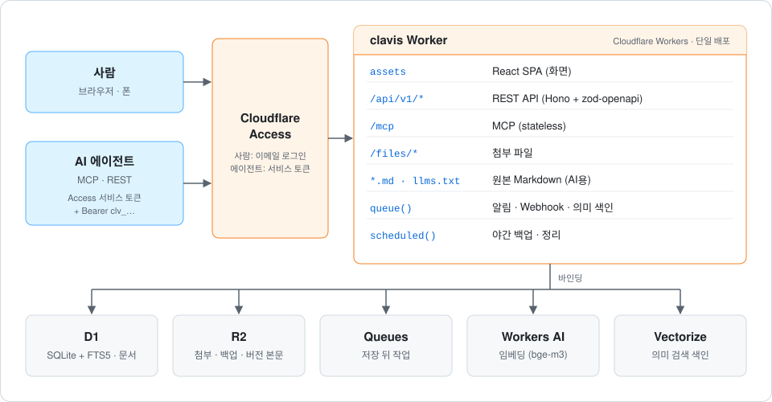

# Clavis

**사람과 AI 에이전트가 함께 읽고 쓰는 Markdown 위키.** 개발팀의 명세·기획·아키텍처 문서를 Markdown 원문 그대로 저장하고, 사람은 웹에서, 에이전트는 MCP·REST로 같은 문서를 다룹니다. Cloudflare 무료 플랜 안에서 돌아갑니다.

*Clavis*는 라틴어로 "열쇠"입니다. 팀의 지식에 사람과 AI가 같은 방식으로 들어가게 하는 열쇠라는 뜻입니다.

누구나 자기 Cloudflare 계정에 설치해 팀 위키로 쓸 수 있습니다 → [설치](#설치)

## 주요 기능

- **Markdown 원문 한 벌**: frontmatter(`type`·`status`·`owner`·`tags`)를 포함한 Markdown이 원본입니다. 화면에 보이는 글과 에이전트가 받는 글이 같습니다.
- **편집**: CodeMirror 6 분할 미리보기, 속성 폼, 위키 링크(`[[제목]]`), 첨부, Mermaid, 초안 자동 보관, 폰 편집(서식 툴바·사진 첨부).
- **문서 규칙(Lint)**: 유형별 필수 섹션, frontmatter, 깨진 링크 등을 편집 중과 저장 시 같은 규칙으로 검사합니다. 규칙 수준과 필수 섹션은 Space마다 바꿀 수 있습니다.
- **함께 쓰기**: 낙관적 잠금(revision)으로 충돌 감지, 섹션 단위 편집, 댓글·답글·해결, `@멘션`, 모든 저장의 버전 기록과 되돌리기.
- **찾기**: 전문 검색(D1 FTS5 trigram)과 의미 검색(Workers AI bge-m3 + Vectorize, H2 섹션 단위).
- **알림**: 앱 안 알림(지켜보기·멘션), Space별 Slack·서명된 JSON Webhook.
- **AI 에이전트가 1급 사용자**: MCP 도구 25개(읽기 전용 에이전트는 17개), REST API(OpenAPI), 페이지별 원본 `.md`와 `llms.txt`. 에이전트가 쓴 글은 🤖와 이름으로 표시됩니다.
- **관리**: 사용자 승인·역할(관리자·편집·읽기), 에이전트 등록·토큰 발급/폐기, Space 관리, 휴지통(30일), 야간 백업.

## 설치

Cloudflare 계정만 있으면 무료 플랜으로 설치할 수 있습니다. Worker 하나에 D1·R2·Queues·Vectorize·Workers AI를 붙이고, 로그인은 Cloudflare Access가 맡습니다.

1. 저장소를 fork(또는 clone)하고 `wrangler login`
2. D1·R2·Queue·Vectorize 리소스 만들기
3. `apps/worker/wrangler.jsonc`에 내 값 넣기 → D1 마이그레이션 → 빌드 → 배포
4. Worker에 Cloudflare Access를 켜고 로그인할 사람을 정한 뒤, 팀 도메인과 AUD 값을 넣어 다시 배포
5. 처음 로그인한 사람이 관리자 → Space 만들기, 팀원 승인, AI 에이전트 연결

명령과 설정 값, 비용, GitHub Actions 자동 배포, 업데이트, 백업, 문제 해결까지 **[설치 가이드](docs/guides/install.md)**에 있습니다. Cloudflare 계정 여러 개를 오가며 배포한다면 → [Cloudflare 계정 바꾸기](#cloudflare-계정-바꾸기).

## 구조



REST와 MCP는 같은 서비스 계층을 호출합니다. Markdown 렌더링은 브라우저에서만 하고, 서버는 저장·검증·색인만 합니다(요청당 CPU 10ms 제약). 자세한 설계는 [`docs/01-architecture.md`](docs/01-architecture.md).

| 영역 | 사용 기술 |
|---|---|
| 런타임 | Cloudflare Workers, TypeScript |
| 백엔드 | Hono, `@hono/zod-openapi`, Drizzle ORM, MCP SDK(`@modelcontextprotocol/server`, `agents`) |
| 저장 | D1, R2, Queues, Workers AI, Vectorize |
| 프론트엔드 | React 19, Vite, TanStack Router·Query, Tailwind CSS v4, shadcn/ui, CodeMirror 6, unified |
| 인증 | Cloudflare Access(사람), Access 서비스 토큰 + Clavis API 토큰(에이전트) |
| 도구 | pnpm 모노레포, Biome, Vitest(`@cloudflare/vitest-pool-workers`), Playwright |

## 저장소 구성

```
apps/
  web/        React SPA (화면, 에디터, Markdown 렌더링, i18n ko/en)
  worker/     Cloudflare Worker (REST, MCP, 서비스 계층, D1 마이그레이션, 백업)
packages/
  shared/     브라우저와 Worker가 함께 쓰는 zod 스키마, Markdown 스캔, lint 엔진·규칙, 템플릿
e2e/          Playwright E2E (데스크톱 1440px, 모바일 Pixel 7)
docs/         컨셉, 아키텍처, Phase별 계획, 결정 로그, 가이드
scripts/      보조 스크립트 (agent-env.py: 에이전트 자격 증명 읽기)
spikes/       Phase 0 기술 검증 기록
```

## 로컬 개발

Cloudflare 계정 없이 내 컴퓨터에서 실행합니다. 필요한 것: Node.js 24(`.nvmrc`, 최소 22), pnpm 12.

```sh
git clone https://github.com/tobyilee/clavis.git && cd clavis
pnpm install
cp apps/worker/.dev.vars.example apps/worker/.dev.vars   # DEV_ACCESS_EMAIL을 내 이메일로
pnpm --filter @clavis/worker db:migrate:local           # 로컬 D1에 마이그레이션 적용
pnpm dev                                                 # Worker :8787 + Vite :5173
```

<http://localhost:5173>을 엽니다. 로컬에는 Cloudflare Access가 없으므로 `DEV_ACCESS_EMAIL`의 사람으로 로그인됩니다(localhost에서만 동작). 처음 로그인한 사람이 관리자가 됩니다.

- 로컬에는 Workers AI·Vectorize가 없어 의미 검색은 전문 검색으로 대신합니다. 색인 실패 로그가 찍혀도 정상입니다.
- 로컬 에이전트 토큰: `pnpm --filter @clavis/worker agent:create --name <이름> --local` → 저장소 루트 `.agent.env`에 기록됩니다(출력되지 않음). 로컬 관리 화면(**관리 → AI 에이전트**)에서 만들어도 됩니다.
- 배포한 Worker를 에이전트로 부를 때: `cp .agent.env.example .agent.env && chmod 600 .agent.env` 후 값을 채우고, `eval "$(python3 scripts/agent-env.py)"`로 읽습니다. 이 파일은 쉘로 `source`하지 않습니다(설명은 예시 파일 안에).

## 테스트

```sh
pnpm exec biome ci .      # 린트·포맷 검사 (고칠 때는 pnpm format)
pnpm -r typecheck
pnpm -r test              # shared · web · worker 단위 테스트
pnpm build && pnpm e2e    # 빌드한 SPA + wrangler dev(:8788, 빈 로컬 D1)로 E2E
```

- E2E 브라우저가 없으면 `pnpm exec playwright install chromium`.
- API 라우트를 바꾸면 `pnpm --filter @clavis/worker openapi`로 OpenAPI 문서를 다시 만듭니다(안 하면 테스트가 실패).
- 스키마를 바꾸면 `apps/worker/src/db/schema.ts` 수정 후 `pnpm --filter @clavis/worker db:generate --name <이름>`.

## 자동 배포 (CI)

`main`에 push하면 GitHub Actions가 검사한 뒤 배포합니다([`.github/workflows/ci.yml`](.github/workflows/ci.yml)).

1. **check**: Biome, typecheck, 단위 테스트, 빌드, E2E
2. **deploy**: D1 마이그레이션(`--remote`) → 웹 빌드 → `wrangler deploy` → 헬스 체크

fork에서 쓰려면 GitHub secrets(`CLOUDFLARE_API_TOKEN`, `CLOUDFLARE_ACCOUNT_ID`)를 넣고 `ci.yml`의 주소를 내 주소로 바꿉니다 → [설치 가이드 §8](docs/guides/install.md#8-github-actions로-자동-배포-선택).

## 버전

지금 버전은 **0.9.0**입니다. [유의적 버전](https://semver.org/lang/ko/)을 따르고, 버전마다 바뀐 내용은 [`CHANGELOG.md`](CHANGELOG.md)에 있습니다.

- **정하는 곳은 한 곳**: 루트 `package.json`의 `"version"`. Worker와 웹 앱이 빌드할 때 `@clavis/shared/version`으로 같은 값을 읽으므로, 계정별 설정 파일에는 버전이 없습니다.
- **보이는 곳**

  | 어디 | 모양 |
  |---|---|
  | 화면 사이드바 맨 아래 (폰은 ☰ 메뉴 안) | `Clavis v0.9.0` — 마우스를 올리면 빌드한 커밋 |
  | `GET /api/v1/health` (로그인한 브라우저에서) | `{"status":"ok","version":"0.9.0","db":"ok"}` |
  | MCP 서버 정보 | 이름 `clavis`, 버전 `0.9.0` |

- **번호 매기기** (1.0 전): 기능 추가·동작 변경은 가운데 자리(`0.9.0` → `0.10.0`), 버그 수정만이면 끝자리(`0.9.0` → `0.9.1`).
- **올리는 방법**
  1. 루트 `package.json`의 `version`을 새 번호로 바꿉니다.
  2. `CHANGELOG.md`의 `[Unreleased]` 제목을 `[새 버전] - 날짜`로 바꾸고, 그 위에 빈 `[Unreleased]`를 둡니다.
  3. 커밋하고 push하면 CI가 배포합니다. 다른 계정에는 [Cloudflare 계정 바꾸기](#cloudflare-계정-바꾸기)대로 배포합니다.
  4. (선택) 태그: `git tag v0.9.1 && git push origin v0.9.1`
- **어느 버전이 배포돼 있나**: 화면의 사이드바 맨 아래, 또는 `/api/v1/health`. 커밋까지 보려면 사이드바 버전에 마우스를 올리거나 `pnpm exec wrangler deployments list`의 메시지를 봅니다.

## Cloudflare 계정 바꾸기

Cloudflare 계정 여러 개를 오가며 배포할 때는 **계정마다 설정 파일을 하나씩** 두고, 배포할 때 그 파일을 고릅니다. `apps/worker/wrangler.jsonc`는 `main` push로 CI가 배포하는 인스턴스의 설정이므로 고치지 않습니다.

### wrangler가 계정을 정하는 방법

| 무엇을 | 정하는 곳 | 설명 |
|---|---|---|
| 누구로 로그인했나 | `wrangler login`(브라우저 OAuth) 또는 환경 변수 `CLOUDFLARE_API_TOKEN` | OAuth는 한 번에 Cloudflare 사용자 한 명만. 토큰이 있으면 토큰이 우선 |
| 그 사용자의 어느 계정인가 | 설정 파일의 `"account_id"` 또는 환경 변수 `CLOUDFLARE_ACCOUNT_ID` | 사용자에게 계정이 하나뿐이면 자동으로 정해짐 |

설정 파일에 `account_id`를 넣어 두면, 다른 사용자로 로그인한 채 배포해도 엉뚱한 계정에 올라가지 않고 오류로 멈춥니다.

아래 예시의 계정 별칭은 `cfuser`입니다. 계정마다 알아보기 쉬운 별칭을 정해 `cfuser` 자리에 씁니다.

### 1. 배포할 계정으로 로그인

```sh
cd apps/worker
pnpm exec wrangler whoami                               # 지금 로그인한 사용자와, 그 사용자의 계정 목록(이름·ID)
pnpm exec wrangler logout && pnpm exec wrangler login   # 다른 이메일로 가입한 계정일 때만
```

- `login`은 브라우저를 열고, 거기서 **Allow**를 누르면 끝납니다. 브라우저가 Cloudflare 대시보드에 **이전 사용자로 로그인돼 있으면 그 사용자로 승인**되므로, 대시보드에서 먼저 로그아웃하거나 다른 브라우저 프로필에서 로그인합니다.
- 한 사용자가 여러 계정에 들어갈 수 있으면(계정 멤버로 초대받은 경우) 로그아웃할 필요 없이 설정 파일의 `account_id`가 계정을 고릅니다.
- 로그인 정보는 컴퓨터에 하나만 저장됩니다(`wrangler whoami`가 위치를 알려 줌). 다른 저장소의 wrangler 명령도 같은 로그인을 씁니다.

### 2. 계정마다 설정 파일 만들기 (처음 한 번)

```sh
cp wrangler.jsonc wrangler.cfuser.jsonc   # .gitignore의 apps/worker/wrangler.*.jsonc라 커밋되지 않음
```

`wrangler.cfuser.jsonc`에서 아래 값을 그 계정의 것으로 바꿉니다.

| 항목 | 값 | 찾는 곳 |
|---|---|---|
| `account_id` (`"name"` 아래에 새로 추가) | 계정 ID (32자리) | `pnpm exec wrangler whoami`, 대시보드 계정 홈 |
| `d1_databases[0].database_id` | 그 계정의 D1 `clavis` ID | `pnpm exec wrangler d1 list` |
| `vars.APP_ORIGIN` | `https://clavis.<서브도메인>.workers.dev` | 배포 결과에 나오는 주소 (Slack·Webhook 메시지의 링크) |
| `vars.ACCESS_TEAM_DOMAIN`, `vars.ACCESS_AUD` | 그 계정 Access 앱의 팀 도메인과 AUD | Zero Trust → Access → Applications ([설치 가이드 §5~§6](docs/guides/install.md#5-cloudflare-access-설정-로그인)) |

- R2 버킷(`clavis-files`)·Queue(`clavis-events`)·Vectorize 인덱스(`clavis-chunks`)는 이름으로 찾습니다. 그 계정에서 같은 이름으로 만들었다면 고치지 않습니다.
- 파일은 `wrangler.jsonc`와 같은 폴더에 둡니다. `main`·`assets.directory`·`migrations_dir`가 이 파일 위치를 기준으로 풀립니다.
- 그 계정에 **이미 Clavis가 배포돼 있으면** 배포된 Worker의 설정에서 값을 그대로 읽어 올 수 있습니다. `bindings`에 D1 ID와 `vars`가 들어 있습니다.

  ```sh
  pnpm exec wrangler deployments list --name clavis                     # 맨 아래 배포의 Version ID
  pnpm exec wrangler versions view <Version ID> --name clavis --json     # resources.bindings
  ```

- 그 계정에 **Clavis가 아직 없으면** 리소스(D1·R2·Queue·Vectorize)와 Access부터 만듭니다 → [설치 가이드](docs/guides/install.md) §2~§6. 명령마다 `-c wrangler.cfuser.jsonc`를 붙입니다.

### 3. 배포

```sh
cd apps/worker
pnpm exec wrangler d1 migrations list DB --remote -c wrangler.cfuser.jsonc    # 적용할 마이그레이션 확인
pnpm exec wrangler d1 migrations apply DB --remote -c wrangler.cfuser.jsonc   # DB 먼저
(cd ../.. && pnpm build)                                                      # 웹 빌드 → apps/web/dist
pnpm exec wrangler deploy -c wrangler.cfuser.jsonc --message "$(git rev-parse --short HEAD)"
```

- **모든 wrangler 명령에 `-c wrangler.cfuser.jsonc`**를 붙입니다. 빠뜨리면 `wrangler.jsonc`(CI가 배포하는 인스턴스)의 값으로 지금 로그인한 계정에 실행됩니다.
- 마이그레이션은 배포보다 먼저 합니다. 새 코드가 새 테이블을 바로 씁니다.
- `--message`는 배포 기록(`deployments list`)에 남아, 어느 커밋을 올렸는지 알 수 있습니다.

### 4. 확인

```sh
curl -sS -o /dev/null -w '%{http_code}\n' https://clavis.<서브도메인>.workers.dev/api/v1/health   # 302 = Access 로그인으로 이동, 정상
pnpm exec wrangler deployments list -c wrangler.cfuser.jsonc                                      # 맨 아래가 방금 배포
```

브라우저로 열어 로그인한 뒤 화면을 확인합니다.

### API 토큰으로 바꾸기 (선택)

로그아웃·로그인 없이, 브라우저도 열지 않고 명령마다 사용자를 바꾸려면 사용자마다 API 토큰을 만들어 둡니다. 권한은 CI용 토큰과 같습니다([설치 가이드 §8](docs/guides/install.md#8-github-actions로-자동-배포-선택)). 토큰은 화면·쉘 기록·채팅에 남기지 않습니다.

토큰을 저장소 루트의 `.agent.env`(git 제외)에 `CLOUDFLARE_API_TOKEN_<별칭>`으로 넣어 두면 `scripts/cf-as.sh <별칭>`이 그 토큰으로 wrangler를 실행합니다. 별칭은 대문자로, `-`는 `_`로 바꿔 씁니다(`cfuser` → `CLOUDFLARE_API_TOKEN_CFUSER`).

```sh
cp .agent.env.example .agent.env && chmod 600 .agent.env   # .agent.env가 없을 때만. 편집기로 토큰 줄을 추가
scripts/cf-as.sh cfuser whoami                             # 토큰의 사용자와 계정 확인
scripts/cf-as.sh cfuser deploy -c wrangler.cfuser.jsonc    # apps/worker에서 실행되므로 경로는 그 기준
```

- 토큰은 그 한 번의 wrangler 실행에만 쓰입니다. 쉘에 남지 않고, `wrangler login`으로 저장된 로그인도 그대로입니다.
- 파일에 두지 않고 한 번만 쓰려면 직접 넣습니다.

```sh
read -rs CLOUDFLARE_API_TOKEN && export CLOUDFLARE_API_TOKEN   # 붙여 넣어도 화면·기록에 남지 않음
pnpm exec wrangler whoami                                      # 토큰의 계정 확인
pnpm exec wrangler deploy -c wrangler.cfuser.jsonc
unset CLOUDFLARE_API_TOKEN                                     # 끝나면 지움 (남아 있으면 OAuth 로그인보다 우선)
```

### 주의

- `wrangler.jsonc`는 고치지 않습니다. 고쳐서 커밋하면 CI가 기존 계정에 새 값으로 배포해 운영 중인 인스턴스가 깨집니다.
- CI는 GitHub secrets의 `CLOUDFLARE_API_TOKEN`·`CLOUDFLARE_ACCOUNT_ID`로 배포하므로, 로컬에서 어느 계정으로 로그인했는지와 상관없습니다.
- 계정마다 Access·D1·R2가 따로입니다. 사람·에이전트 로그인과 문서 데이터도 계정마다 따로이고, 서로 옮겨지지 않습니다.

## AI 에이전트 연결

에이전트는 관리자가 등록하고 토큰을 발급합니다. 연결에는 헤더 세 개가 필요합니다.

```sh
claude mcp add --transport http --scope user clavis https://clavis.<서브도메인>.workers.dev/mcp \
  --header "CF-Access-Client-Id: $CLAVIS_CF_ACCESS_CLIENT_ID" \
  --header "CF-Access-Client-Secret: $CLAVIS_CF_ACCESS_CLIENT_SECRET" \
  --header "Authorization: Bearer $CLAVIS_TOKEN"
```

등록 요청부터 Claude Desktop·Cursor·VS Code·Hermes 설정, 도구 목록, REST·Webhook까지는 [`docs/guides/agent-connection.md`](docs/guides/agent-connection.md)에 있습니다. REST 명세는 `/api/v1/openapi.json`, 문서 화면은 `/api/v1/docs`.

## 문서

| 문서 | 내용 |
|---|---|
| [`CHANGELOG.md`](CHANGELOG.md) | 주요 변경 내역 (업데이트할 때 할 일 포함) |
| [`docs/00-concept.md`](docs/00-concept.md) | 컨셉, 목표와 비목표, 기능 범위 |
| [`docs/01-architecture.md`](docs/01-architecture.md) | 기술 아키텍처, 데이터 모델, API, 무료 플랜 한도 |
| [`docs/decisions.md`](docs/decisions.md) | 결정 로그 (`D-xx`) |
| [`docs/02-phase0-plan.md`](docs/02-phase0-plan.md) ~ [`docs/05-phase3-plan.md`](docs/05-phase3-plan.md) | Phase별 계획과 결과 |
| [`docs/handoff.md`](docs/handoff.md) | 작업 인수인계: 현재 상태, 작업 규칙, 보안 수칙, 제약과 요령 |
| [`docs/guides/install.md`](docs/guides/install.md) | 설치 가이드: 내 Cloudflare 계정에 설치·운영 |
| [`docs/guides/writing.md`](docs/guides/writing.md) | 문서 작성 가이드 (사람용) |
| [`docs/guides/agent-connection.md`](docs/guides/agent-connection.md) | AI 에이전트 연결 가이드 (MCP·REST·Webhook) |
