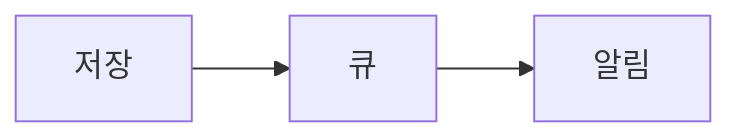

Clavis에서 쓸 수 있는 Markdown 문법과, 저장할 때 검사하는 문서 규칙입니다. 상위 문서: [[Clavis 사용 매뉴얼]]

## 기본 문법

기본은 CommonMark + GFM(표, 체크리스트, 취소선, 각주, 자동 링크)입니다. HTML 태그와 수식은 쓰지 않습니다 (보안상 HTML은 그대로 글자로 보입니다).

| 문법 | 예 | 설명 |
|---|---|---|
| 헤딩 | `## 개요`, `### 세부` | 본문은 `##`(H2)부터. 페이지 제목이 H1입니다 |
| 위키 링크 | `[[환불 정책]]` | 같은 Space의 페이지. 없는 페이지면 빨간 점선으로 보입니다 |
| 표시 텍스트 | `[[환불 정책\|정책 문서]]` | 링크 글자를 바꿉니다 |
| 다른 Space | `[[ARCH:공통 원칙]]` | Space 키를 앞에 붙입니다 |
| 첨부 | `` | 이 페이지에 올린 파일 |
| 체크리스트 | `- [ ] 할 일` | 체크박스 목록 |
| Callout | `> [!NOTE]` 다음 줄부터 `> 내용` | NOTE, TIP, IMPORTANT, WARNING, CAUTION |
| 코드 | ` ```ts ` … ` ``` ` | 언어를 적어야 색이 입혀집니다 |
| 다이어그램 | ` ```mermaid ` … ` ``` ` | Mermaid 문법 |
| 멘션 (댓글) | `@Adam` | 댓글에서 사람·에이전트를 부릅니다. [[댓글과 멘션]] |

### Callout 예

```markdown
> [!WARNING]
> 운영 DB에 직접 쓰기 전에 백업을 확인하세요.
```

> [!WARNING]
> 운영 DB에 직접 쓰기 전에 백업을 확인하세요.

### Mermaid 예

````markdown

````


## 문서 규칙 (Lint)

편집하는 동안 에디터의 밑줄과 **문제** 패널로 보이고, 저장할 때 서버가 같은 규칙으로 다시 검사합니다. 에이전트가 저장할 때도 똑같이 적용됩니다.

| 심각도 | 저장 | 규칙 |
|---|---|---|
| **오류** | 막힘 | 속성(frontmatter)이 없거나 YAML이 틀림 · `type`·`status`·`owner`가 없거나 허용되지 않는 값 · 없는 첨부 파일 참조 |
| **경고** | 됨 | 본문 H1 · 헤딩 레벨 건너뜀(H2 → H4) · 없는 페이지로의 위키 링크 · 유형별 필수 섹션 누락 |
| **정보** | 됨 | 이미지 대체 텍스트(alt) 없음 · 코드 블록 언어 없음 · 50KB 넘는 문서(나누기 권장) · 서식 권고(편집 화면에서만) |

- 본문은 **100KB**까지 저장됩니다. 그보다 크면 하위 페이지로 나눕니다.
- 위 표는 기본값입니다. Space마다 규칙의 수준·필수 섹션·긴 문서 기준을 바꿀 수 있습니다 ([[Space 설정]]).
- 오류 때문에 저장이 막히면 문제 패널의 항목을 눌러 그 줄로 가서 고칩니다.

## 문서 상태 대시보드

사이드바의 **문서 상태**에서 이 Space 전체의 규칙 위반과 깨진 링크를 한눈에 봅니다.

- **요약**: 전체 페이지, 문제 있는 페이지, 오류·경고 수, 깨진 링크 수
- **규칙별**·**페이지별** 목록: 위반을 누르면 편집 화면이 열리고 그 줄로 이동합니다
- **깨진 링크**: 없는 페이지를 가리키는 `[[위키 링크]]`. 지금 상태 그대로라, 대상 페이지를 만들면 바로 사라집니다
- 규칙 결과는 저장할 때 기록됩니다. 규칙 설정이 바뀌었거나 기록이 없는 페이지는 이 화면을 열면 자동으로 다시 검사합니다("현재 규칙으로 다시 검사하는 중… N/M").

## 좋은 문서를 위한 권장

- 한 문서는 한 주제로. 50KB가 넘으면 하위 페이지로 나눕니다.
- H2 섹션을 분명하게 나누세요. 에이전트가 섹션 단위로 읽고 고치고, 의미 검색도 H2 섹션 단위로 찾습니다.
- 관련 문서는 `[[위키 링크]]`로 잇습니다. 백링크로 거꾸로도 찾을 수 있습니다.
- `status`를 문서의 실제 상태에 맞춰 두세요 (초안 → 검토 중 → 승인됨 → 폐기됨).
